# Moffat Bay Marina - Database ERD

- Team: Blue Team
- Roster: Breutzmann, R. | White, S. | Fernandez, M. | Rodriguez, C.
- CSD 460 - Moffat Bay Marina
- Comment citation: The formatting and some of the prose of this document (such as the header) was drafted with the assistance of Claude (Anthropic) and reviewed by the database lead, Breutzmann, R. All decisions and ERD design is 100% made by the developers.  Changelog maintained by Claude as well, verified by Database Lead, Breutzmann, R.
- Version: 1.1.0
- Date: 2026-08-27

## Overview

This is the official ERD for the Moffat Bay Marina database (`moffatBayMarinaDB`). It backs the marina's slip-reservation system: matching a boat's length to one of three slip sizes, tracking slip availability across the marina's docks, and driving the wait-list flow when a size is full. 

## Entity Relationship Diagram

```mermaid
%% Combined ERD - every team member's tables in one diagram.
%% Per-section sources are listed below. Table names are PascalCase and
%% type keywords are UPPERCASE throughout; column/PK/FK naming still
%% varies by author (see the casing note in Design Decisions) since
%% that's a schema decision, not just a diagram formatting one.

erDiagram
    %% --- Breutzmann, R. - Dock & Slip ---
    Slip {
        INT slipId PK "Unique identifier for the slip in the DB"
        INT slipNumber "Customer facing slip number."
        VARCHAR slipDescription "A customer facing brief description of the slip."
        INT dockID FK "The dock ID that the slip is on, links to dockID."
        VARCHAR slipStatus "Current availability of the slip (occupied, available, under maintenance, unavailable). Can be an enum or predefined value"
        INT slipSizeID FK "References the slip's size category, references SlipSize.slipSizeID"
    }

    Dock {
        INT dockID PK "Unique identifier for the dock in the DB"
        VARCHAR dockNumber "Customer facing dock letter, e.g. A-C."
        VARCHAR dockDescription "A customer facing brief description of the dock."
    }

    %% --- Fernandez, M. - Customer & Boat ---
    Customer {
        INT customerId PK "Unique ID for each customer"
        VARCHAR firstName "Customer first name"
        VARCHAR lastName "Customer last name"
        VARCHAR email UK "Login username and contact email"
        VARCHAR passwordHash "Hashed password, validated in Java before hashing"
        VARCHAR phone "Contact phone number"
        VARCHAR streetAddress "Mailing street address"
        VARCHAR city "Mailing city"
        CHAR state "Two letter state code"
        VARCHAR zipCode "Zip code, varchar for leading zeros"
        DATE dateJoined "Date account was created"
    }

    Boat {
        INT boatId PK "Unique ID for each boat"
        VARCHAR boatName "Name of the vessel - may change with boat ownership."
        VARCHAR hin UK "Hull identification number. Can be null for qualifying older boats without a HIN, other proof of ownership still required."
        CHAR regState UK "State the boat is registered in"
        VARCHAR regNumber UK "State registration number, unique with regState"
        VARCHAR boatType "Sailboat, powerboat, catamaran, etc"
        DECIMAL boatLength "Length in feet, for slip fit"
        DECIMAL boatBeam "Width in feet, for slip fit"
        INT boatYear "Model year, can be null"
    }

    %% --- White, S. - Boat Ownership (added v1.1.0) ---
    %% Replaces the old direct Boat.customerId FK with a Customer<->Boat
    %% many-to-many relationship, so the marina can keep ownership history
    %% instead of only the current owner.
    BoatOwnership {
        INT ownershipId PK "Unique ID for each record of boat ownership"
        INT boatId FK "References the boat being owned, references Boat.boatId"
        INT customerId FK "References the customer with proof of ownership, references Customer.customerId"
        DATE startDate "Date that boat ownership begins, not null"
        DATE endDate "Date that boat ownership ends - null if current owner"
    }

    %% --- White, S. - Slip Size & Wait List ---
    SlipSize {
        INT slipSizeID PK "Unique ID for the slip Size"
        INT sizeFt UK "Slip size in feet"
    }

    WaitList {
        INT waitListID PK "Unique wait list entry identifier"
        INT customerId FK "Customer requesting a slip"
        INT slipSizeID FK "Requested slip size, references SlipSize.slipSizeID"
        TIMESTAMP timeJoined "Time added to the wait list"
        TIMESTAMP timeClosed "Time removed from the wait list; null while active"
        STRING status "Current wait list status"
    }

    %% --- Rodriguez, C. - Reservation & Termination Notice ---
    Reservation {
        INT reservationId PK "Unique internal identifier for the reservation"
        VARCHAR confirmationNumber UK "Unique confirmation number shown to the customer"
        INT customerId FK "References the customer who made the reservation"
        INT boatId FK "References the boat assigned to the reservation"
        INT slipId FK "References the reserved marina slip"
        DATE startDate "Date the month-to-month lease begins"
        DECIMAL monthlyRate "Monthly rental rate at the time of reservation"
        VARCHAR reservationStatus "Current status of the reservation"
    }

    TerminationNotice {
        INT terminationNoticeId PK "Unique identifier for the termination notice"
        INT reservationId FK "References the reservation being terminated"
        DATE noticeDate "Date the customer submitted the 30-day notice"
        DATE terminationDate "Date the lease is scheduled to end"
        VARCHAR noticeStatus "Current status of the termination notice"
    }

    %% --- Relationships ---
    Dock ||--o{ Slip : "has"
    Customer ||--o{ Reservation : "makes"
    Boat ||--o{ Reservation : "assigned to"
    Customer ||--o{ WaitList : "joins"
    Slip ||--o{ Reservation : "reserved for"
    SlipSize ||--o{ WaitList : "requested for"
    SlipSize ||--o{ Slip : "categorizes"
    Reservation ||--o{ TerminationNotice : "may have"
    Customer ||--o{ BoatOwnership : "owns through"
    Boat ||--|{ BoatOwnership : "ownership history"

%% A specific slip's location to a customer will be dockNumber-slipNumber.
%% The Descriptions are a short description for the customer about where to find the dock or slip.
%% Mermaid has no composite key syntax: regState/regNumber each show a UK
%% marker below, but together they form ONE composite unique constraint.
%% Reservation.customerId is a direct FK as of v1.1.0 (previously reached only
%% by joining Reservation.boatId -> Boat.customerId -> Customer.email).
%% Boat ownership moved to BoatOwnership (added v1.1.0) instead of a direct
%% Boat.customerId column, since a boat can change hands and the marina needs
%% ownership history, not just the current owner - current owner is the
%% BoatOwnership row with endDate IS NULL.
%% WaitList now references Customer directly (v1.1.0) instead of Boat, since a
%% customer can join the wait list before registering the boat that will fill it.
```

Sources (one `.mmd` per team member, merged above; see Changelog for v1.1.0 updates):

- `Module-3/Breutzmann-ERD-Draft/slip.mmd` - dock, slip
- `Module-3/Fernandez-ERD-DRAFT/Customer_Boat_ERD.mmd` - customer, boat
- `Module-3/SARA-ERD_MMD/waitlist_slipsize.mmd` - original slipSize, waitList draft
- `Module-3/SARA-ERD_MMD/Sara_proposed_ERD.mmd` - v1.1.0: adds BoatOwnership, and reworks slip/waitList/reservation FKs (see Changelog)
- `Module-3/Rodriguez-ERD/Rodriguez_ERD.mmd` - Reservation, TerminationNotice

## Design Decisions

- **`PascalCase` and `camelCase`** Table names are `PascalCase` and column names are `camelCase` following standard conventions.
- **`dockNumber` is `varchar(1)`, not `int`.** Docks are customer-facing letters (A-C), not numbers, so the ERD and schema were revised to match. The original draft had this as `int`.
- **3 docks, all on one shoreline.** Per the client's marina map (`DevNotes/marina_a.png`), the marina has 3 linear docks (A, B, C) along a single harbor-side shoreline - dock descriptions reflect relative position along that one shoreline, not a compass side.
- **Seed data: 24 slips per dock, sourced from the client's marina map** Each dock is two mirrored columns of 12 slips; within each column slips 1-3/13-15 = 50 ft, 4-7/16-19 = 40 ft, and 8-12/20-24 = 26 ft, giving 6 x 50 ft, 8 x 40 ft, and 10 x 26 ft per dock (72 slips total). See `definitions_decisions.md` for the full breakdown.
- **`slipSize` table to be used instaed of an enum** since multiple tables touch the slipSize.  This also future proofs the slip size in case they ever change or more sizes get added.
- **No waitlist queue position stored in database** even though this means Marina personell cannot manually "bump" people up the list. An intentional design decision, made to keep within the scope of the design specs, to simplily the database.  Position in queue can be determined by calulating the time joined and seeing how many people joined before that person did.
- **`boat` table** created to allow custoemrs have have more than one boat.
- **`customer.email` has a `UNIQUE` constraint at the database level.** Email doubles as the login username, so app-level checks alone aren't enough - two signups submitted at the same time could both pass an app-level "is this email taken" check before either is saved. The DB constraint is the actual guarantee against duplicate logins.
- **Boat `year` is stored as `INT`, not MySQL's `YEAR` type.** `YEAR` isn't standard SQL and maps awkwardly through JDBC, so a plain `INT` was used instead - simpler on both the SQL and Java sides.
- **Boat table adds a `regState` column, with a composite `UNIQUE (regState, regNumber)`.** Registration numbers are only unique per state (e.g. FL and GA could issue the same number), so a single-column `UNIQUE` on the number alone wasn't correct. Decided and owned by Fernandez, M. rather than needing full team sign-off, since the change is contained to the `boat` table and nothing else references it.
- **All foreign keys are added at the end of the create script**, after every team member's tables are created, via `ALTER TABLE ... ADD CONSTRAINT` in `01_create_database.sql`'s Foreign Keys section - not inline on the `CREATE TABLE` statements. This avoids FK creation failing due to table-creation order as more people's tables are added.
- **`BoatOwnership` table added (v1.1.0)** to track boat ownership over time, replacing the direct `Boat.customerId` FK with a `Customer` <-> `Boat` many-to-many relationship. This lets the marina keep ownership history when a boat changes hands, instead of only ever knowing the current owner. The current owner is the `BoatOwnership` row with `endDate IS NULL`. Proposed by White, S.
- **`Boat.hin` added (v1.1.0)**, a nullable `UNIQUE` Hull Identification Number, as an additional way to identify a boat alongside `regState`/`regNumber`. Nullable to allow qualifying older boats without a HIN, provided other proof of ownership is on file.
- **`Slip.slipSizeID` FK added (v1.1.0), replacing the old `slipSize` enum-style column.** Slip size is now defined once in `SlipSize` and referenced from `Slip`, instead of being duplicated inline as a checked `(26, 40, 50)` value.
- **`WaitList.customerId` replaces `WaitList.boatID` (v1.1.0).** The wait list tracks which customer is waiting for a slip size, not which boat, since a customer can join the wait list before registering the boat that will occupy the slip.
- **`Reservation.customerId` added as a direct FK (v1.1.0).** Previously the customer tied to a reservation was only reachable by joining through `Boat`; this is now a stored column, matching how `Customer` "makes" `Reservation` is drawn in the diagram.

## Changelog

### v1.1.0 - 2026-08-27

- **Added the `BoatOwnership` table**, tracking the history of who owns each boat via a `Customer` <-> `Boat` many-to-many relationship (`Customer ||--o{ BoatOwnership`, `Boat ||--|{ BoatOwnership`), replacing the previous direct `Boat.customerId` foreign key. A boat's current owner is the `BoatOwnership` row with `endDate IS NULL`.
- Added `Boat.hin` (nullable, `UNIQUE` Hull Identification Number).
- Added `Slip.slipSizeID` FK (`SlipSize ||--o{ Slip : "categorizes"`), replacing the `slipSize` enum-style column on `Slip`.
- Added `SlipSize.sizeFt` `UNIQUE` constraint.
- Changed `WaitList.boatID` to `WaitList.customerId` - the wait list now tracks the requesting customer rather than a specific boat.
- Added `Reservation.customerId` as a direct FK, replacing the earlier join-through-`Boat` design.
- Source: `Module-3/SARA-ERD_MMD/Sara_proposed_ERD.mmd` (White, S.)

### v1.0.0 - 2026-08-26

- Initial combined ERD merging all four team members' table designs (Dock/Slip, Customer/Boat, SlipSize/WaitList, Reservation/TerminationNotice).
