# Moffat Bay Marina - Database ERD

- Team: Blue Team
- Roster: Breutzmann, R. | White, S. | Fernandez, M. | Rodriguez, C.
- CSD 460 - Moffat Bay Marina
- Comment citation: The formatting and some of the prose of this document (such as the header) was drafted with the assistance of Claude (Anthropic) and reviewed by the database lead, Breutzmann, R. All decisions and ERD design is 100% made by the developers. Design Decisions notes maintained by Claude as well, verified by Database Lead, Breutzmann, R.
- Version: 1.0.0
- Date: 2026-08-28

## Overview

This is the official ERD for the Moffat Bay Marina database (`moffatBayMarinaDB`). It backs the marina's slip-reservation system: matching a boat's length to one of three slip sizes, tracking slip availability across the marina's docks, and driving the wait-list flow when a size is full. The database is versioned: `DatabaseVersion` (Table 0) records which script version last built it, so a running instance can be queried to confirm what it's running without needing the `.sql` file that created it.

## Entity Relationship Diagram

```mermaid
%% Combined ERD - every team member's tables in one diagram.

erDiagram
    %% =============================================================================
    %% Table 0: DatabaseVersion | Owner: Breutzmann, R. (Database Lead) |
    %% Inward FKs (none)
    %% Outward FKs (none)
    %% Standalone metadata table; records which script version last built the DB.
    %% =============================================================================
    DatabaseVersion {
        INT databaseVersionID PK "Unique identifier for the version record"
        VARCHAR version "Semantic version of the script that built this database, e.g. 1.0.0"
        DATE appliedDate "Date this version was applied to the database"
        VARCHAR description "Brief note on what this version changed"
    }

    %% =============================================================================
    %% Table 1: Dock | Owner: Breutzmann, R. |
    %% Inward FKs Dock.dockID <- Slip.dockID
    %% Outward FKs (none)
    %% One row per physical dock (A-C) along the marina's single shoreline.
    %% =============================================================================
    Dock {
        INT dockID PK "Unique identifier for the dock in the DB"
        VARCHAR dockNumber "Customer facing dock letter, e.g. A-C."
        VARCHAR dockDescription "A customer facing brief description of the dock."
    }

    %% =============================================================================
    %% Table 2: Employee | Owner: Breutzmann, R. |
    %% Inward FKs Employee.employeeID <- Contact.respondedEmployeeID
    %% Outward FKs (none)
    %% Staff accounts; employees log in and respond to Contact submissions.
    %% =============================================================================
    Employee {
        INT employeeID PK "Unique ID for each employee"
        VARCHAR firstName "Employee first name"
        VARCHAR lastName "Employee last name"
        VARCHAR email UK "Login username and contact email"
        VARCHAR passwordHash "SHA-256 hashed password, validated in Java before hashing"
        VARCHAR phone "Contact phone number"
        VARCHAR jobTitle "Employee job title"
        DATE hireDate "Date employee was hired"
    }

    %% =============================================================================
    %% Table 3: Customer | Owner: Fernandez, M. |
    %% Inward FKs Customer.customerID <- Reservation.customerID,
    %%            Customer.customerID <- WaitList.customerID,
    %%            Customer.customerID <- BoatOwnership.customerID
    %% Outward FKs (none)
    %% Customer accounts; email is the login username, UNIQUE at the DB level.
    %% =============================================================================
    Customer {
        INT customerID PK "Unique ID for each customer"
        VARCHAR firstName "Customer first name"
        VARCHAR lastName "Customer last name"
        VARCHAR email UK "Login username and contact email"
        VARCHAR passwordHash "SHA-256 hashed password, validated in Java before hashing"
        VARCHAR phone "Contact phone number"
        VARCHAR streetAddress "Mailing street address"
        VARCHAR city "Mailing city"
        CHAR state "Two letter state code"
        VARCHAR zipCode "Zip code, varchar for leading zeros"
        DATE dateJoined "Date account was created"
    }

    %% =============================================================================
    %% Table 4: Boat | Owner: Fernandez, M. |
    %% Inward FKs Boat.boatID <- Reservation.boatID, Boat.boatID <- BoatOwnership.boatID
    %% Outward FKs (none)
    %% A vessel's identity only - no owner column; ownership lives in BoatOwnership.
    %% =============================================================================
    Boat {
        INT boatID PK "Unique ID for each boat"
        VARCHAR boatName "Name of the vessel - may change with boat ownership."
        VARCHAR HIN UK "Hull identification number. Can be null for qualifying older boats without a HIN, other proof of ownership still required."
        CHAR regState UK "State the boat is registered in"
        VARCHAR regNumber UK "State registration number, unique with regState"
        VARCHAR boatType "Sailboat, powerboat, catamaran, etc"
        DECIMAL boatLength "Length in feet, for slip fit"
        DECIMAL boatBeam "Width in feet, for slip fit"
        INT boatYear "Model year, can be null"
    }

    %% =============================================================================
    %% Table 5: Slip | Owner: Breutzmann, R. |
    %% Inward FKs Slip.slipID <- Reservation.slipID
    %% Outward FKs Slip.dockID FK -> Dock.dockID,
    %%             Slip.slipSizeID FK -> SlipSize.slipSizeID
    %% One row per physical slip; tracks size, dock, and current availability.
    %% =============================================================================
    Slip {
        INT slipID PK "Unique identifier for the slip in the DB"
        INT slipNumber "Customer facing slip number."
        VARCHAR slipDescription "A customer facing brief description of the slip."
        INT dockID FK "The dock ID that the slip is on, links to dockID."
        VARCHAR slipStatus "Current availability of the slip (occupied, available, under maintenance, unavailable). Can be an enum or predefined value"
        INT slipSizeID FK "References the slip's size category, references SlipSize.slipSizeID"
    }

    %% =============================================================================
    %% Table 6: Contact | Owner: Breutzmann, R. |
    %% Inward FKs (none)
    %% Outward FKs Contact.respondedEmployeeID FK -> Employee.employeeID
    %% Contact Us submissions; visitor may not be a registered Customer/Boat yet.
    %% =============================================================================
    Contact {
        INT contactID PK "Unique identifier for the contact-us submission"
        VARCHAR firstName "Contact's first name, required"
        VARCHAR lastName "Contact's last name, required"
        VARCHAR email "Contact's email address, required"
        VARCHAR boatName "Name of the contact's boat, optional - free text, not a Boat reference"
        DECIMAL boatLength "Length of the contact's boat in feet, optional"
        VARCHAR reasonForContact "Enum of common reasons (e.g. reservation question, waitlist question, billing, maintenance) plus Other"
        TEXT message "Full text of the message submitted"
        BOOLEAN responded "Whether marina staff has responded to this submission"
        TIMESTAMP respondedDate "Date/time staff responded, null until responded"
        TEXT respondedMessage "Staff's response message, null until responded"
        INT respondedEmployeeID FK "References Employee.employeeID - the employee who responded, null until responded"
    }

    %% =============================================================================
    %% Table 7: Reservation | Owner: Rodriguez, C. |
    %% Inward FKs Reservation.reservationID <- TerminationNotice.reservationID
    %% Outward FKs Reservation.customerID FK -> Customer.customerID,
    %%             Reservation.boatID FK -> Boat.boatID,
    %%             Reservation.slipID FK -> Slip.slipID
    %% A boat's month-to-month lease of a slip, tied to the booking customer.
    %% =============================================================================
    Reservation {
        INT reservationID PK "Unique internal identifier for the reservation"
        VARCHAR confirmationNumber UK "Unique confirmation number shown to the customer"
        INT customerID FK "References the customer who made the reservation"
        INT boatID FK "References the boat assigned to the reservation"
        INT slipID FK "References the reserved marina slip"
        DATE startDate "Date the month-to-month lease begins"
        DECIMAL monthlyRate "Monthly rental rate at the time of reservation"
        VARCHAR reservationStatus "Current status of the reservation"
    }

    %% =============================================================================
    %% Table 8: Termination Notice (TerminationNotice) | Owner: Rodriguez, C. |
    %% Inward FKs (none)
    %% Outward FKs TerminationNotice.reservationID FK -> Reservation.reservationID
    %% 30-day notice a customer files to end a Reservation's lease.
    %% =============================================================================
    TerminationNotice {
        INT terminationNoticeID PK "Unique identifier for the termination notice"
        INT reservationID FK "References the reservation being terminated"
        DATE noticeDate "Date the customer submitted the 30-day notice"
        DATE terminationDate "Date the lease is scheduled to end"
        VARCHAR noticeStatus "Current status of the termination notice"
    }

    %% =============================================================================
    %% Table 9: Slip Size (SlipSize) | Owner: White, S. |
    %% Inward FKs SlipSize.slipSizeID <- Slip.slipSizeID,
    %%            SlipSize.slipSizeID <- WaitList.slipSizeID
    %% Outward FKs (none)
    %% Lookup of valid slip sizes in feet (26/40/50). NOT YET IN THE SQL SCRIPT.
    %% =============================================================================
    SlipSize {
        INT slipSizeID PK "Unique ID for the slip Size"
        INT sizeFt UK "Slip size in feet"
    }

    %% =============================================================================
    %% Table 10: Wait List (WaitList) | Owner: White, S. |
    %% Inward FKs (none)
    %% Outward FKs WaitList.customerID FK -> Customer.customerID,
    %%             WaitList.slipSizeID FK -> SlipSize.slipSizeID
    %% Customers waiting for a slip size when none are available. NOT YET BUILT.
    %% =============================================================================
    WaitList {
        INT waitListID PK "Unique wait list entry identifier"
        INT customerID FK "Customer requesting a slip"
        INT slipSizeID FK "Requested slip size, references SlipSize.slipSizeID"
        TIMESTAMP timeJoined "Time added to the wait list"
        TIMESTAMP timeClosed "Time removed from the wait list; null while active"
        STRING status "Current wait list status"
    }

    %% =============================================================================
    %% Table 11: Boat Ownership (BoatOwnership) | Owner: White, S. |
    %% Inward FKs (none)
    %% Outward FKs BoatOwnership.boatID FK -> Boat.boatID,
    %%             BoatOwnership.customerID FK -> Customer.customerID
    %% Customer<->Boat ownership history; current owner has endDate NULL. TBD.
    %% =============================================================================
    BoatOwnership {
        INT ownershipID PK "Unique ID for each record of boat ownership"
        INT boatID FK "References the boat being owned, references Boat.boatID"
        INT customerID FK "References the customer with proof of ownership, references Customer.customerID"
        DATE startDate "Date that boat ownership begins, not null"
        DATE endDate "Date that boat ownership ends - null if current owner"
    }

    %% --- Relationships ---
    Dock ||--o{ Slip : "has"
    Customer ||--o{ Reservation : "makes"
    Boat ||--o{ Reservation : "assigned to"
    Customer ||--o{ WaitList : "joins"
    Slip ||--o{ Reservation : "reserved for"
    SlipSize ||--o{ WaitList : "requested for"
    SlipSize ||--o{ Slip : "categorizes"
    Reservation ||--o{ TerminationNotice : "may have"
    Customer ||--o{ BoatOwnership : "owns through"
    Boat ||--|{ BoatOwnership : "ownership history"
    Employee ||--o{ Contact : "responds to"
```

## Design Decisions

- **`DatabaseVersion` (Table 0)** is a standalone metadata table, no FKs in or out, holding one row that records which version of the build script last created the database (`version`, `appliedDate`, `description`). MySQL has no built-in concept of a "database version" the way some other systems do, so this is hand-rolled: it makes a running instance self-describing - anyone connected to it can query `DatabaseVersion` to confirm which schema/seed-data version they're looking at, instead of needing to track down the `.sql` file that built it. Since the whole database is dropped and recreated on every run of the script (see `DROP DATABASE IF EXISTS` in `MoffatBayMarinaDB_V1-0-0.sql`), this stays a single current-version row rather than an accumulating history/migration log.
- **`PascalCase` and `camelCase`** Table names are `PascalCase` and column names are `camelCase` following standard conventions.
- **`ID` is capitalized in table names** As an example `slipID` or `customerID` rather than `slipId` or `customerId`.
- **3 docks, all on one shoreline.** Per the client's marina map (`Source_Information/marina_a.png`), the marina has 3 linear docks (A, B, C) along a single harbor-side shoreline - dock descriptions reflect relative position along that one shoreline, not a compass side.
- **Seed data: 24 slips per dock, sourced from the client's marina map** Each dock is two mirrored columns of 12 slips; within each column slips 1-3/13-15 = 50 ft, 4-7/16-19 = 40 ft, and 8-12/20-24 = 26 ft, giving 6 x 50 ft, 8 x 40 ft, and 10 x 26 ft per dock (72 slips total). See `definitions_decisions.md` for the full breakdown.
- **No waitlist queue position stored in database** even though this means Marina personnel cannot manually "bump" people up the list. An intentional design decision, made to keep within the scope of the design specs, to simplify the database.  Position in queue can be determined by calculating the time joined and seeing how many people joined before that person did.
- **`Customer.email` has a `UNIQUE` constraint at the database level.** Email doubles as the login username, so app-level checks alone aren't enough - two signups submitted at the same time could both pass an app-level "is this email taken" check before either is saved. The DB constraint is the actual guarantee against duplicate logins.
- **Boat `year` is stored as `INT`, not MySQL's `YEAR` type.** `YEAR` isn't standard SQL and maps awkwardly through JDBC, so a plain `INT` was used instead - simpler on both the SQL and Java sides (This gap was noted by Claude, and verified with a google search).
- **Boat table adds `regState` and `regNumber` columns, for a composite `UNIQUE (regState, regNumber)`.** Registration numbers are only unique per state (e.g. FL and GA could issue the same number), so a single-column `UNIQUE` on the number alone wasn't correct. Decided and owned by Fernandez, M. rather than needing full team sign-off, since the change is contained to the `Boat` table and nothing else references it.
- **`BoatOwnership` table** tracks boat ownership over time via a `Customer` <-> `Boat` many-to-many relationship, rather than a direct `Boat.customerID` FK. This lets the marina keep ownership history when a boat changes hands, instead of only ever knowing the current owner. The current owner is the `BoatOwnership` row with `endDate IS NULL`. Proposed by White, S.  Agreed to by the rest of the team.  (This is noted as beyond the scope of the original requirements, but didn't cost much extra to add.)
- **`Boat.HIN`**, a nullable `UNIQUE` Hull Identification Number, is an additional way to identify a boat alongside `regState`/`regNumber` (proposed by White, S. alongside `BoatOwnership`). Nullable to allow qualifying older boats without a HIN, provided other proof of ownership is on file.
- **`Slip.slipSizeID` FK replaces the old `slipSize` enum-style column.** Slip size is now defined once in `SlipSize` - which also carries a `UNIQUE` constraint on `sizeFt` so the same size can't be entered twice - and referenced from `Slip`, instead of being duplicated inline as a checked `(26, 40, 50)` value.
- **`WaitList.customerID` replaces `WaitList.boatID`.** The wait list tracks which customer is waiting for a slip size, not which boat, since a customer can join the wait list before registering the boat that will occupy the slip.
- **`Reservation.customerID` is a direct FK.** The customer tied to a reservation is reachable directly, rather than only by joining through `Boat`, matching how `Customer` "makes" `Reservation` is drawn in the diagram.
- **`Contact` table has no FK to `Customer` or `Boat`.** It holds Contact Us page submissions, and a submitter may not be a registered customer yet, so `boatName`/`boatLength` are free text the visitor typed in, not references into `Boat`.
- **`Contact.message`/`Contact.respondedMessage` use `TEXT`, not `VARCHAR`.** A contact-us message (and a staff reply to it) has no natural length cap, so an unbounded `TEXT` column was used instead of guessing at a `VARCHAR` limit.
- **`Contact.reasonForContact` is a `VARCHAR` holding an enum-style value (common reasons plus "Other"), not a dedicated lookup table**, matching how `Slip.slipStatus` already represents its enum in this diagram - the exact reason list is an implementation detail for the `CREATE TABLE` script, not the ERD.
- **`Contact.respondedEmployeeID` is a nullable FK to `Employee.employeeID`** (`Employee ||--o{ Contact : "responds to"`), null until a submission is answered - mirroring how `responded`/`respondedDate`/`respondedMessage` are already null until responded.
- **`Employee` table mirrors `Customer`'s account fields** (`email` as a `UNIQUE` login username, `passwordHash`, `phone`) plus `jobTitle` and `hireDate`, since staff need to log in and respond to `Contact` submissions the same way customers log in to make reservations.
- **`passwordHash` (both `Employee` and `Customer`) is a SHA-256 digest**, computed with MySQL's `SHA2(<plaintext>, 256)` to match how the seed data in the database creation script is hashed. This is the project's actual password hashing scheme (unsalted) - not a placeholder to be swapped out later, since no further "real auth" phase follows this submission.
  - The password hashing done in SQL lets us load a password hash into the table using SHA-256. `SHA2('Password1', 256)` enters into the database as `19513fdc9da4fb72a4a05eb66917548d3c90ff94d5419e1f2363eea89dfee1dd`.
  - This means our program MUST use SHA-256 hashing (unsalted) in order to authenticate correctly.
