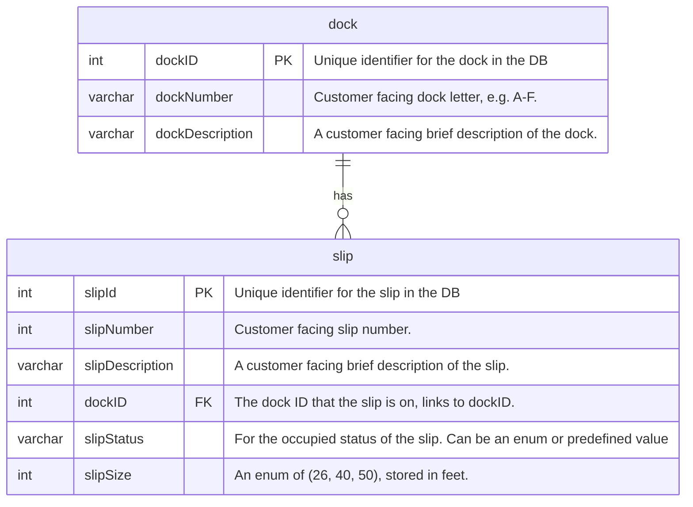

# Moffat Bay Marina - Database ERD

- Team: Blue Team
- Roster: Breutzmann, R. | White, S. | Fernandez, M. | Rodriguez, C.
- CSD 460 - Moffat Bay Marina
- Comment citation: The formatting and some of the prose of this document (such as the header) 
  was drafted with the assistance of Claude (Anthropic) and reviewed by the database lead,
  Breutzmann, R. All decisions and ERD design is 100% made by the developers.
- Version: 0.5.0 (in progress - moves to 1.0.0 once every team member's
  entities are in)
- Date: 2026-08-25

## Overview

This is the official ERD for the Moffat Bay Marina database
(`moffatBayMarinaDB`). It backs the marina's slip-reservation system:
matching a boat's length to one of three slip sizes, tracking slip
availability across the marina's docks, and driving
the wait-list flow when a size is full. 

## Entity Relationship Diagram

Source: `Module-3/ERD/slip.mmd`.

## Design Decisions

### Robert Breutzmann

- **`dockNumber` is `varchar(1)`, not `int`.** Docks are customer-facing
  letters (A-F), not numbers, so the ERD and schema were revised to
  match. The original draft had this as `int`.
- **6 docks, all on one shoreline.** Per client notes, the marina's docks
  sit along a single harbor-side shoreline rather than being split across
  different sides of the island - dock descriptions reflect relative
  position along that one shoreline, not a compass side.
- **Seed data: 10 slips per dock, 2:2:1 size ratio (26 ft : 40 ft :
  50 ft).** No slip counts are specified anywhere in the project docs
  (README, `definitions.md`, ERD). This ratio and count are a
  developer decision for placeholder data, not sourced from any
  outside reference - it could change if the client gives real data.
- **`slipSize` is enforced with a `CHECK` constraint, not an `ENUM`.**
  It's a numeric measurement (feet), not a label, so `INT` with
  `CHECK (slipSize IN (26, 40, 50))` was used instead of the string-based
  `ENUM` type.
- **All foreign keys are added at the end of the create script**, after
  every team member's tables are created, via `ALTER TABLE ... ADD
  CONSTRAINT` in `01_create_database.sql`'s Foreign Keys section - not
  inline on the `CREATE TABLE` statements. This avoids FK creation
  failing due to table-creation order as more people's tables are added.
