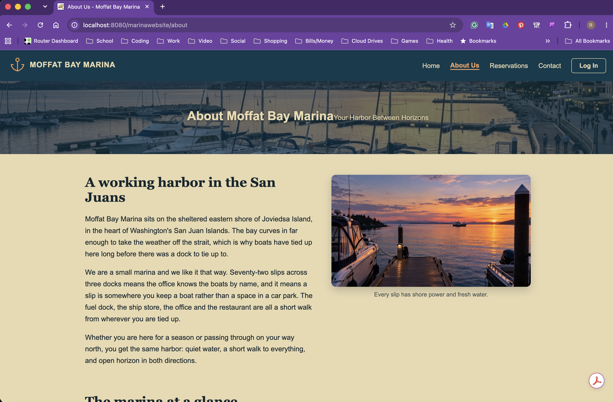
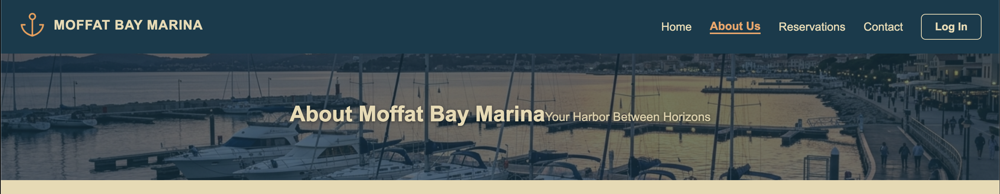
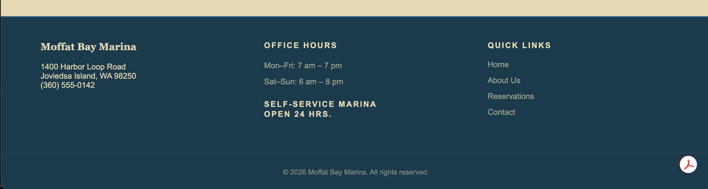
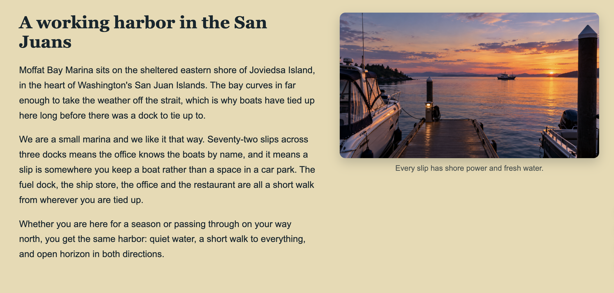
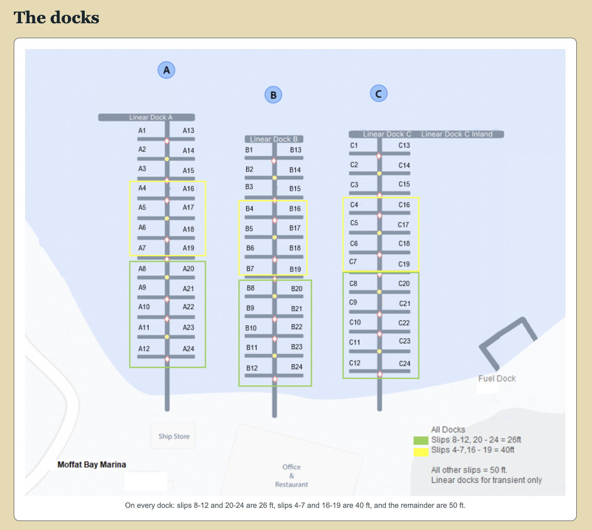
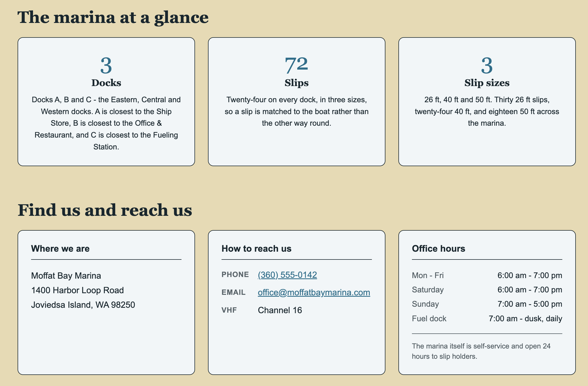
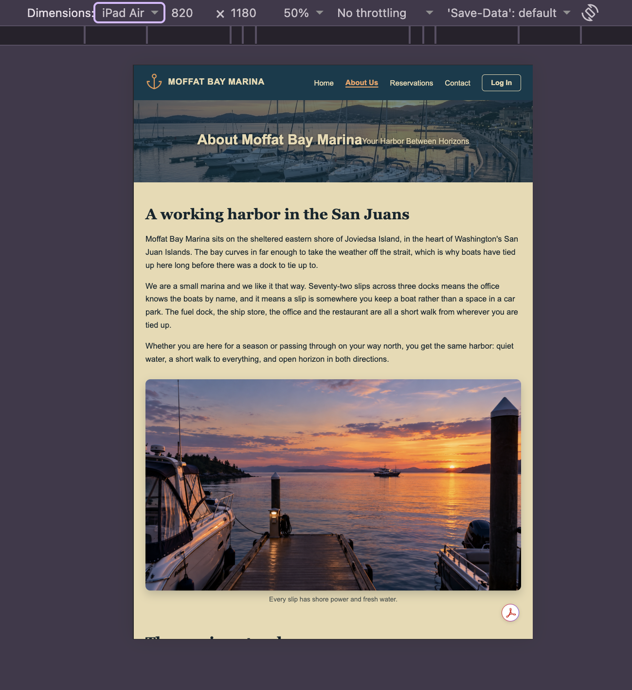
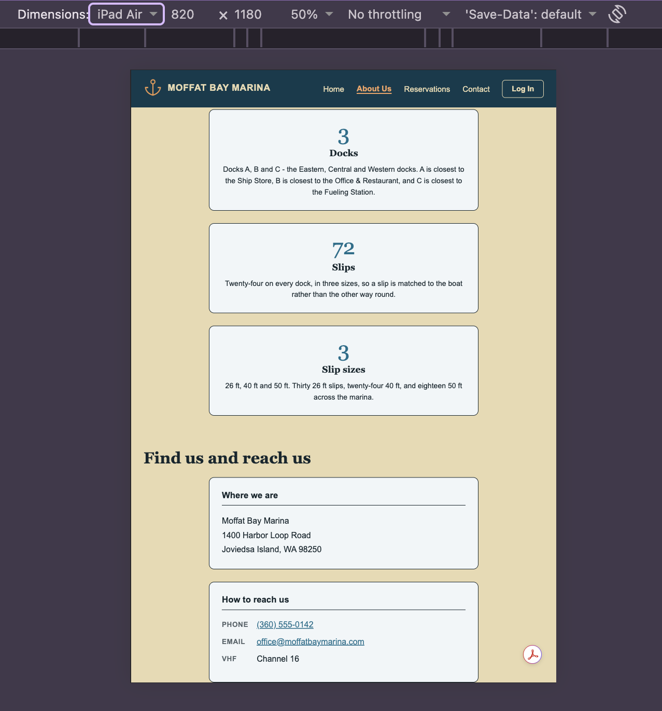
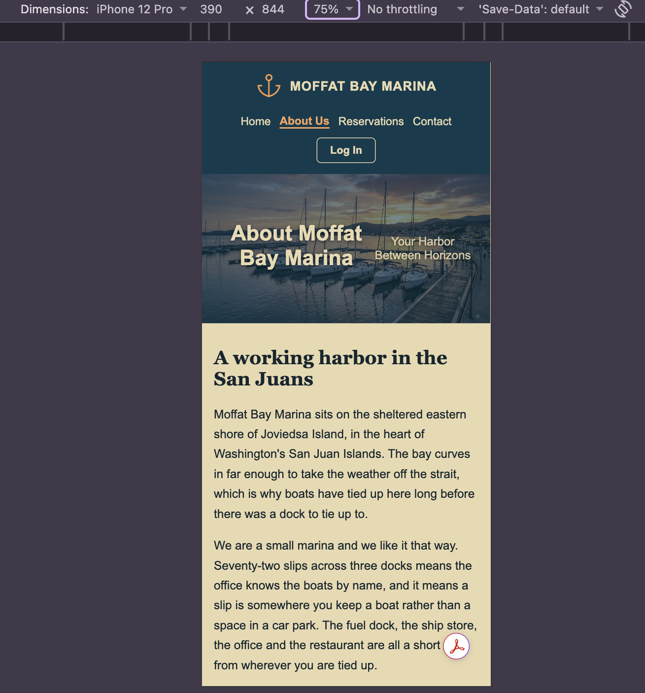

**Project:** Blue Team — Moffat Bay Marina
**Course:** CSD 460 - Capstone Project
**Description:** Functional test plan for the Reservation (Book a Slip) page, its handoff to the Reservation Summary page, and the wait-list path and the About Us page, including page content, navigation, responsiveness, and public access.
**Date:** 2026/09/09

To complete the test case plan, fill out the information for Project, Course, Description and Date in the header above.

## Table of Contents

- **Test 1:** New Slip Reservation Matches Through to the Reservation Summary Page and Posts to MySQL
- **Test 2:** Reservation Page Reflects Reduced Availability Immediately After Booking
- **Test 3:** A Full Slip Size Notifies the Customer, Offers the Wait List, and Never Creates a Reservation
- **Test 4:** Reservation Booking and Cancellation via Reservation Summary
- **Test 5:** About Us Page Loads and Displays Correctly
- **Test 6:** About Us Navigation
- **Test 7:** About Us Page Has Public Access
- **Test 8:** About Us Content Accuracy

For each test, the <u>developer</u> should: provide a test description, a test objective, the developer name and date tested. For each step, fill out the actions to be taken and describe the expected results, and check Pass or Fail. The <u>peer tester</u> should provide their name, date tested, check Pass or Fail for each step, and fill out the Screenshots list below the table with the matching screenshot number for each item.

## Test 1: New Slip Reservation Matches Through to the Reservation Summary Page and Posts to MySQL

**Test Objective:** Verifies that a new slip reservation submitted from the Reservation page carries the same boat, dock, and pricing details through to the Reservation Summary page, and that the booking (and any newly registered boat) is correctly written to the database.

**Developer:** Robert Breutzmann · **Date tested:** Sept 11, 2026
**Peer tester:** · **Date tested:** \<yyyy/mm/dd>

| Step | Action | Expected Results | Developer | Tester |
|---|---|---|---|---|
| 1 | <ol><li>Go to http://localhost:8080/marinawebsite/ (or http://localhost:8081/marinawebsite/).</li><li>Log in with elena.marsh@example.com / Password1.</li><li>Open the Reservation page (click "Book a Slip" or navigate directly to reservation.jsp).</li></ol> | The header shows "Welcome, Elena M." and the Reservation page loads showing the Choose Your Vessel dropdown (Elena's existing boat listed with a "(reserved)" tag), the 26/40/50 ft slip cards, and the three dock cards. | ☑&nbsp;Pass<br>☐&nbsp;Fail | ☐&nbsp;Pass<br>☐&nbsp;Fail |
| 2 | <ol><li>Click "Register another boat."</li><li>In the panel, enter:<ul><li>Boat Name: QA Test Skiff</li><li>Boat Type: Skiff</li><li>Boat Length: 22.0</li><li>Boat Beam: 8.0</li><li>HIN: QTB123456789</li><li>Registration Number: WA10001QT</li><li>Boat Year: 2024</li></ul></li><li>Click "Save boat."</li></ol> | The panel closes without reloading the page, "QA Test Skiff — 22.0 ft" appears in the Boat dropdown already selected, the status popup shows "Boat saved," and the page re-prices for a 26 ft boat. | ☑&nbsp;Pass<br>☐&nbsp;Fail | ☐&nbsp;Pass<br>☐&nbsp;Fail |
| 3 | With "QA Test Skiff" selected, record the number shown on the 26 ft Slip card and the number shown on each of the Dock A, Dock B, and Dock C cards. | The 26 ft Slip card shows a count greater than zero and is highlighted "Fits your boat"; each dock card shows its own open count for 26 ft slips; the Reservation Summary sidebar shows Vessel "QA Test Skiff — 22.0 ft" and Monthly Rate "\$231.00." | ☑&nbsp;Pass<br>☐&nbsp;Fail | ☐&nbsp;Pass<br>☐&nbsp;Fail |
| 4 | <ol><li>Select the Dock A radio button.</li><li>Check "Yes, I need an electric hookup."</li><li>Set the Start Date field to today's date.</li></ol> | The Reservation Summary sidebar updates live: Dock shows "Dock A," an Electric hookup line appears showing "\$10.50," Start Date shows today's date, Monthly Rate updates to "\$241.50," and the "Reserve My Slip" button becomes enabled. | ☑&nbsp;Pass<br>☐&nbsp;Fail | ☐&nbsp;Pass<br>☐&nbsp;Fail |
| 5 | <ol><li>Record the Vessel, Dock, Start Date, Electric hookup, and Monthly Rate values shown in the Reservation Summary sidebar.</li><li>Click "Reserve My Slip."</li></ol> | The browser redirects to reservationSummary.jsp?confirmation=MB-##### with a new confirmation number, and the Reservation Summary page displays the same vessel, dock, start date, electric hookup, and \$241.50 monthly rate recorded just before submitting. | ☑&nbsp;Pass<br>☐&nbsp;Fail | ☐&nbsp;Pass<br>☐&nbsp;Fail |
| 6 | Confirm the new records in MySQL (see the query below the table). | The Boat query returns one row for "QA Test Skiff" with boatLength 22.0. The BoatOwnership query returns one row linking that boat to customerID 1, with today's date as startDate and a NULL endDate. The Reservation query returns exactly one Active row for customerID 1 on Dock A, sizeFt 26, with a monthlyRate matching the total shown on the Reservation Summary page in Step 5. | ☑&nbsp;Pass<br>☐&nbsp;Fail | ☐&nbsp;Pass<br>☐&nbsp;Fail |

For step 6, use these queries:

```sql
USE MoffatBayMarinaDB;

SELECT boatID, boatName, boatLength
FROM Boat
WHERE boatName = 'QA Test Skiff';

SELECT * FROM BoatOwnership
WHERE boatID = <boatID from above> AND customerID = 1;

SELECT r.confirmationNumber, r.customerID, r.boatID, r.slipID, r.startDate, r.monthlyRate, r.reservationStatus,
       s.slipNumber, d.dockNumber, sz.sizeFt
FROM Reservation r
JOIN Slip s ON s.slipID = r.slipID
JOIN Dock d ON d.dockID = s.dockID
JOIN SlipSize sz ON sz.slipSizeID = s.slipSizeID
WHERE r.confirmationNumber = '<confirmation number from Step 5>';
```

**Comments:**

> [!note] Developer (Robert)
> Test passes. Minor visual bug with creating a new boat, the register a new boat popup modal scrolls weird, leaving the background "greying" exposing some of the page behind it and allowing for scrolling on the main page. Tester Fixed this before handing off to peer testing.

> [!note] Peer Tester (Carolina)
>

**Screenshots**

1. Header showing "Welcome, Elena M." with the Reservation page loaded: vessel dropdown, slip cards, and dock cards visible. — **Screenshot #:**
2. Boat panel closed, "QA Test Skiff — 22.0 ft" selected in the dropdown, and the "Boat saved" status popup. — **Screenshot #:**
3. 26 ft Slip card and Dock A/B/C cards with their availability counts, plus the Reservation Summary sidebar showing Vessel and Monthly Rate. — **Screenshot #:**
4. Reservation Summary sidebar after selecting Dock A and electric hookup, showing the updated Monthly Rate and the enabled "Reserve My Slip" button. — **Screenshot #:**
5. Reservation Summary page after submitting, showing the new confirmation number and matching vessel/dock/date/rate details. — **Screenshot #:**
6. MySQL client output for the three verification queries (Boat, BoatOwnership, Reservation). — **Screenshot #:**

## Test 2: Reservation Page Reflects Reduced Availability Immediately After Booking

**Test Objective:** Verifies that after a slip is booked, the Reservation page marks that boat as already reserved and drops the affected slip-size and dock availability counts by exactly one, matching the database.

**Developer:** Robert Breutzmann · **Date tested:** Sept 11, 2026
**Peer tester:** · **Date tested:** \<yyyy/mm/dd>

| Step | Action | Expected Results | Developer | Tester |
|---|---|---|---|---|
| 1 | Immediately after Test 1, use the header navigation to return to http://localhost:8080/marinawebsite/reservation.jsp. | The Reservation page performs a fresh page load (not the cached in-page state from before submitting) and shows the Choose Your Vessel dropdown again. | ☑&nbsp;Pass<br>☐&nbsp;Fail | ☐&nbsp;Pass<br>☐&nbsp;Fail |
| 2 | Open the Boat dropdown. | "QA Test Skiff — 22.0 ft (reserved)" is listed with the "(reserved)" tag, reflecting the booking just made in Test 1. | ☑&nbsp;Pass<br>☐&nbsp;Fail | ☐&nbsp;Pass<br>☐&nbsp;Fail |
| 3 | Select "QA Test Skiff — 22.0 ft (reserved)" from the dropdown. | An inline message appears under the dropdown reading "QA Test Skiff already has an active reservation." and the "Reserve My Slip" button stays disabled: the boat cannot be booked into a second slip. | ☑&nbsp;Pass<br>☐&nbsp;Fail | ☐&nbsp;Pass<br>☐&nbsp;Fail |
| 4 | <ol><li>With that boat still selected, compare the number now shown on the 26 ft Slip card to the number recorded in Test 1, Step 3.</li><li>Compare the Dock A count to the number recorded for Dock A in that same step.</li></ol> | The 26 ft Slip card reads exactly one less than the count recorded in Test 1; the Dock A card reads exactly one less than the count recorded for Dock A in Test 1; the Dock B and Dock C counts are unchanged, since only a Dock A slip was booked. | ☑&nbsp;Pass<br>☐&nbsp;Fail | ☐&nbsp;Pass<br>☐&nbsp;Fail |
| 5 | Confirm the same drop directly in MySQL (see the query below the table). | Dock A's openSlips is exactly one less than it was before Test 1's booking. Dock B and Dock C are unchanged. The sum of openSlips across all three docks matches the total shown on the 26 ft Slip card in Step 4. | ☑&nbsp;Pass<br>☐&nbsp;Fail | ☐&nbsp;Pass<br>☐&nbsp;Fail |

For step 5, use this query:

```sql
USE MoffatBayMarinaDB;

SELECT d.dockNumber,
       SUM(CASE WHEN r.reservationID IS NULL THEN 1 ELSE 0 END) AS openSlips
FROM Slip s
JOIN Dock d ON d.dockID = s.dockID
JOIN SlipSize sz ON sz.slipSizeID = s.slipSizeID
LEFT JOIN Reservation r ON r.slipID = s.slipID AND r.reservationStatus = 'Active'
WHERE sz.sizeFt = 26 AND s.slipStatus = 'operational'
GROUP BY d.dockNumber
ORDER BY d.dockNumber;
```

**Comments:**

> [!note] Developer (Robert)
> This test fully passes. Before handing off to Peer tester, I added a summary of why the reservation cannot be booked below the disabled "RESERVE" button as a helper, so the "This boat already has a reservation" line now appears there as well.

> [!note] Peer Tester (Carolina)
>

**Screenshots**

1. Fresh page load of the Reservation page showing the Choose Your Vessel dropdown. — **Screenshot #:**
2. Boat dropdown open, showing "QA Test Skiff — 22.0 ft (reserved)." — **Screenshot #:**
3. Inline "already has an active reservation" message with the disabled "Reserve My Slip" button. — **Screenshot #:**
4. 26 ft Slip card and Dock A/B/C cards showing the reduced counts. — **Screenshot #:**
5. MySQL query output showing openSlips per dock after the booking. — **Screenshot #:**

## Test 3: A Full Slip Size Notifies the Customer, Offers the Wait List, and Never Creates a Reservation

**Test Objective:** Verifies that selecting a boat whose matched slip size has no open slots shows the full-size notice instead of a dock/reservation flow, that joining the wait list writes a WaitList row and redirects to the Wait List Lookup page stub, and that no Reservation row is ever created for that boat.

**Developer:** Robert Breutzmann · **Date tested:** Sept 11, 2026
**Peer tester:** · **Date tested:** \<yyyy/mm/dd>

| Step | Action | Expected Results | Developer | Tester |
|---|---|---|---|---|
| 1 | Confirm the current 40 ft availability in MySQL before starting (see the query below the table). | Per the seeded data, there are no open 40 ft slips. This query should return 0 \| 0 \| 0 | ☑&nbsp;Pass<br>☐&nbsp;Fail | ☐&nbsp;Pass<br>☐&nbsp;Fail |
| 2 | <ol><li>Log in as elena.marsh@example.com / Password1.</li><li>Open the Reservation page.</li><li>Register a new boat with:<ul><li>Boat Name: QA Overflow Boat</li><li>Boat Type: Sailboat</li><li>Boat Length: 35.0</li><li>Boat Beam: 11.0</li><li>HIN: QOB123456789</li><li>Registration Number: WA10003QT</li><li>Boat Year: 2023</li></ul></li><li>Select it from the dropdown.</li></ol> | The moment the boat is selected — before any dock is chosen — the availability panel shows "All of our 40 ft slips are currently reserved." All three dock radio buttons read "No 40 ft slips free here" and are disabled, and "Reserve My Slip" is disabled. No reservation can be submitted. | ☑&nbsp;Pass<br>☐&nbsp;Fail | ☐&nbsp;Pass<br>☐&nbsp;Fail |
| 3 | <ol><li>Under the notice, confirm the wait-list question "Would you like to be added to the wait list for a 40 ft slip? We'll contact you when one opens up." appears with "Join the wait list" and "No thanks" buttons.</li><li>Click "Join the wait list."</li></ol> | The browser redirects to waitListLookup.jsp?notice=waitListJoined&size=40. Because the Wait List Lookup page has not been built yet, this lands on the shared "Coming Soon" placeholder for "The Wait List Lookup page" — the expected behavior until that page ships. | ☑&nbsp;Pass<br>☐&nbsp;Fail | ☐&nbsp;Pass<br>☐&nbsp;Fail |
| 4 | Confirm the result in MySQL (see the query below the table). | The WaitList query returns one new row for customerID 1 at sizeFt 40 with status "Waiting." The Reservation query returns zero rows — "QA Overflow Boat" was never assigned a slip or booked. | ☑&nbsp;Pass<br>☐&nbsp;Fail | ☐&nbsp;Pass<br>☐&nbsp;Fail |
| 5 | <ol><li>Go back to the Reservation page.</li><li>Select "QA Overflow Boat" again.</li><li>Click "Join the wait list" a second time.</li></ol> | Instead of a second entry, the wait-list panel shows "You're already on the wait list for a 40 ft slip," the Join button is hidden, and re-running the WaitList query from Step 5 still returns exactly one row for customerID 1 at size 40. | ☑&nbsp;Pass<br>☐&nbsp;Fail | ☐&nbsp;Pass<br>☐&nbsp;Fail |

For step 1, use this query:

```sql
USE MoffatBayMarinaDB;

SELECT d.dockNumber,
       SUM(CASE WHEN r.reservationID IS NULL THEN 1 ELSE 0 END) AS openSlips
FROM Slip s
JOIN Dock d ON d.dockID = s.dockID
JOIN SlipSize sz ON sz.slipSizeID = s.slipSizeID
LEFT JOIN Reservation r ON r.slipID = s.slipID AND r.reservationStatus = 'Active'
WHERE sz.sizeFt = 40 AND s.slipStatus = 'operational'
GROUP BY d.dockNumber;
```

For step 4, use these queries:

```sql
USE MoffatBayMarinaDB;

SELECT w.waitListID, w.status, w.timeJoined, sz.sizeFt
FROM WaitList w
JOIN SlipSize sz ON sz.slipSizeID = w.slipSizeID
WHERE w.customerID = 1
ORDER BY w.timeJoined DESC
LIMIT 1;

SELECT * FROM Reservation r
JOIN Boat b ON b.boatID = r.boatID
WHERE b.boatName = 'QA Overflow Boat';
```

**Comments:**

> [!note] Developer (Robert)
> This test also passed. No notes to add as everything functioned exactly as it should. The test landed at a stub page, rather than the actual waitlist. The waitlist entry was created as the waitlistDAO stub was made to allow an entry to go into the database.

> [!note] Peer Tester (Carolina)
>

**Screenshots**

1. MySQL query output confirming zero open 40 ft slips. — **Screenshot #:**
2. Reservation page with "QA Overflow Boat" selected, showing the "All of our 40 ft slips are currently reserved" notice and disabled dock options. — **Screenshot #:**
3. Wait-list prompt and the resulting redirect to the Wait List Lookup "Coming Soon" placeholder. — **Screenshot #:**
4. MySQL query output showing the new WaitList row and zero Reservation rows for the boat. — **Screenshot #:**
5. Wait-list panel on the second attempt, showing "You're already on the wait list." — **Screenshot #:**

## Test 4: Reservation Booking and Cancellation via Reservation Summary

**Test Objective:** Verifies the full reservation lifecycle: booking a slip from the Reservation page, confirming the details on the Reservation Summary page, cancelling the reservation, and verifying the cancellation is reflected on both the Summary page and in the database.

**Developer:** Robert Breutzmann · **Date tested:** Sept 11, 2026
**Peer tester:** · **Date tested:** \<yyyy/mm/dd>

| Step | Action | Expected Results | Developer | Tester |
|---|---|---|---|---|
| 1 | <ol><li>Log in as elena.marsh@example.com / Password1.</li><li>Navigate to the Reservation page.</li></ol> | The header shows "Welcome, Elena M." and the Reservation page loads. The boat dropdown lists "Salt Whisper — 24.5 ft (reserved)" since her existing boat already has an active reservation. | ☑&nbsp;Pass<br>☐&nbsp;Fail | ☐&nbsp;Pass<br>☐&nbsp;Fail |
| 2 | <ol><li>Click "Register another boat."</li><li>In the panel, enter:<ul><li>Boat Name: QA Cancel Test</li><li>Boat Type: Skiff</li><li>Boat Length: 20.0</li></ul></li><li>Leave Boat Beam, HIN, Registration Number, and Boat Year blank.</li><li>Click "Save boat."</li></ol> | The panel closes, "QA Cancel Test — 20.0 ft" appears in the dropdown already selected, and the page re-prices for a 26 ft slip. The Reservation Summary sidebar shows Vessel "QA Cancel Test — 20.0 ft" and Monthly Rate "\$210.00." | ☑&nbsp;Pass<br>☐&nbsp;Fail | ☐&nbsp;Pass<br>☐&nbsp;Fail |
| 3 | <ol><li>Select the Dock B radio button.</li><li>Set the Start Date field to today's date.</li></ol> | The Reservation Summary sidebar updates: Dock shows "Dock B," Start Date shows today's date, and the "Reserve My Slip" button becomes enabled. | ☑&nbsp;Pass<br>☐&nbsp;Fail | ☐&nbsp;Pass<br>☐&nbsp;Fail |
| 4 | Click "Reserve My Slip." | The browser redirects to reservationSummary?confirmation=MB-##### with a new confirmation number. The Reservation Summary page shows status "Active," vessel "QA Cancel Test," location "Dock B, Slip #," start date matching today, and Monthly Rate "\$210.00/mo." | ☑&nbsp;Pass<br>☐&nbsp;Fail | ☐&nbsp;Pass<br>☐&nbsp;Fail |
| 5 | <ol><li>In the "Manage Your Reservation" section, click "Cancel Reservation."</li><li>When the browser confirmation dialog appears, click OK.</li></ol> | The page reloads. The hero area now shows a red ✗ mark with heading "Your Reservation Has Been Cancelled" and the text "This reservation is no longer active." The status band shows "Cancelled." The Cancel button is gone; only "Back to Reservations" remains. | ☑&nbsp;Pass<br>☐&nbsp;Fail | ☐&nbsp;Pass<br>☐&nbsp;Fail |
| 6 | Confirm the cancellation in MySQL (see the query below the table). | The query returns one row with reservationStatus = "Cancelled" for customerID 1 and boatName "QA Cancel Test." | ☑&nbsp;Pass<br>☐&nbsp;Fail | ☐&nbsp;Pass<br>☐&nbsp;Fail |
| 7 | <ol><li>Navigate back to the Reservation page.</li><li>Open the boat dropdown.</li></ol> | "QA Cancel Test — 20.0 ft" no longer shows the "(reserved)" tag, confirming the cancellation freed the boat for re-booking. | ☑&nbsp;Pass<br>☐&nbsp;Fail | ☐&nbsp;Pass<br>☐&nbsp;Fail |

For step 6, use this query:

```sql
USE MoffatBayMarinaDB;

SELECT r.confirmationNumber, r.reservationStatus, r.customerID, b.boatName
FROM Reservation r
JOIN Boat b ON b.boatID = r.boatID
WHERE b.boatName = 'QA Cancel Test';
```

**Comments:**

> [!note] Developer (Robert)
> This test performed just fine. I added some back end to this to ensure that this doesn't accidently submit twice.

> [!note] Peer Tester (Carolina)
>

**Screenshots**

1. Header showing "Welcome, Elena M." with "Salt Whisper — 24.5 ft (reserved)" in the boat dropdown. — **Screenshot #:**
2. Boat panel closed with "QA Cancel Test — 20.0 ft" selected and the Reservation Summary sidebar pricing. — **Screenshot #:**
3. Reservation Summary sidebar after selecting Dock B and today's date, with "Reserve My Slip" enabled. — **Screenshot #:**
4. Reservation Summary page after booking, showing status "Active" and the confirmation details. — **Screenshot #:**
5. Reservation Summary page after cancellation, showing the red ✗ mark and "Cancelled" status band. — **Screenshot #:**
6. MySQL query output confirming reservationStatus = "Cancelled." — **Screenshot #:**
7. Boat dropdown showing "QA Cancel Test — 20.0 ft" without the "(reserved)" tag. — **Screenshot #:**

## Test 5: About Us Page Loads and Displays Correctly

**Test Objective:** Verify the About Us page loads correctly and displays all expected content

**Developer:** Carolina Rodriguez · **Date tested:** 09/10/26
**Peer tester:** Robert Breutzmann · **Date tested:** 09/12/26

| Step | Action | Expected Results | Developer | Tester |
|---|---|---|---|---|
| 1 | Open the About Us page from the website navigation. | The About Us page loads without errors. | ☐&nbsp;Pass<br>☐&nbsp;Fail | ☑&nbsp;Pass<br>☐&nbsp;Fail |
| 2 | Verify the header and footer are visible. | All text and headings are readable and properly formatted. | ☐&nbsp;Pass<br>☐&nbsp;Fail | ☐&nbsp;Pass<br>☑&nbsp;Fail |
| 3 | Verify all images load. | Images display without broken links or distortion. | ☐&nbsp;Pass<br>☐&nbsp;Fail | ☑&nbsp;Pass<br>☐&nbsp;Fail |
| 4 | Check the page for overlapping or cut-off content. | All sections display correctly with no layout issues. | ☐&nbsp;Pass<br>☐&nbsp;Fail | ☑&nbsp;Pass<br>☐&nbsp;Fail |

**Comments:**

> [!bug] Peer Tester (Robert)
> The Hero Banner text should be on two lines but shows on one.

> [!warning] Peer Tester (Robert)
> When on a Phone (specifically the iPhone 12) Design, the Header expands to 2 lines.  Where as not a bug, this is visually not the way to go.  We may want to revisit the responsive design of the menu and have it be a dropdown for the mobile

**Screenshots**

1. About Us page loaded, full view.
   
2. Header and footer, close up.
    
    
3. Any image sections on the page. 
    
    
    
4. Any section where content overlaps or is cut off.
    
    
    
    

## Test 6: About Us Navigation

**Test Objective:** Verify all navigation links on the About Us page work correctly.

**Developer:** Carolina Rodriguez · **Date tested:** \<yyyy.mm.dd>
**Peer tester:** · **Date tested:** \<yyyy/mm/dd>

| Step | Action | Expected Results | Developer | Tester |
|---|---|---|---|---|
| 1 | Click About Us from the main navigation. | User is taken to the About Us page. | ☐&nbsp;Pass<br>☐&nbsp;Fail | ☐&nbsp;Pass<br>☐&nbsp;Fail |
| 2 | Click the logo/home link. | User is returned to the landing page. | ☐&nbsp;Pass<br>☐&nbsp;Fail | ☐&nbsp;Pass<br>☐&nbsp;Fail |
| 3 | Click another navigation option like Reservation. | Correct page opens. | ☐&nbsp;Pass<br>☐&nbsp;Fail | ☐&nbsp;Pass<br>☐&nbsp;Fail |
| 4 | Use the browser back button. | Return to the About Us page. | ☐&nbsp;Pass<br>☐&nbsp;Fail | ☐&nbsp;Pass<br>☐&nbsp;Fail |

**Comments:** Comments should be substantive; this means there should be at least 2-3 well-structured sentences with constructive feedback.

**Screenshots**

1. About Us page reached from the main nav.

2. Landing page after clicking the logo/home link

3. The other page (e.g. Reservation) after navigating to it.

4. About Us page after using the browser back button.


## Test 7: About Us Page Has Public Access

**Test Objective:** Verify the About Us page works for signed out users and displays correctly on different screen sizes.

**Developer:** Carolina Rodriguez · **Date tested:** \<yyyy/mm/dd>
**Peer tester:** · **Date tested:** \<yyyy/mm/dd>

| Step | Action | Expected Results | Developer | Tester |
|---|---|---|---|---|
| 1 | Sign out of user log in. | Users are signed out successfully. | ☐&nbsp;Pass<br>☐&nbsp;Fail | ☐&nbsp;Pass<br>☐&nbsp;Fail |
| 2 | Open the About Us page. | Able to access About Us page even without login | ☐&nbsp;Pass<br>☐&nbsp;Fail | ☐&nbsp;Pass<br>☐&nbsp;Fail |
| 3 | Resize the browser page to half the size of your screen. | Page adjusts without overlapping. | ☐&nbsp;Pass<br>☐&nbsp;Fail | ☐&nbsp;Pass<br>☐&nbsp;Fail |
| 4 | Scroll through full page. | All information can be viewed without extending off screen. | ☐&nbsp;Pass<br>☐&nbsp;Fail | ☐&nbsp;Pass<br>☐&nbsp;Fail |

**Comments:** Comments should be substantive; this means there should be at least 2-3 well-structured sentences with constructive feedback.

**Screenshots**

1. Signed-out state (e.g. header showing Login/Register instead of an account name). — **Screenshot #:**
2. About Us page accessed while signed out. — **Screenshot #:**
3. About Us page at half browser width, showing no overlap. — **Screenshot #:**
4. Bottom of the page after scrolling through, showing no content cut off. — **Screenshot #:**

## Test 8: About Us Content Accuracy

**Test Objective:** Verify that the information shown on the About Us page is complete and consistent with the rest of the Moffat Bay Marina website.

**Developer:** Carolina Rodriguez · **Date tested:** \<yyyy/mm/dd>
**Peer tester:** · **Date tested:** \<yyyy/mm/dd>

| Step | Action | Expected Results | Developer | Tester |
|---|---|---|---|---|
| 1 | Review all headings and paragraph text on the About Us page. | Text is complete, readable, and free of obvious spelling or grammar errors. | ☐&nbsp;Pass<br>☐&nbsp;Fail | ☐&nbsp;Pass<br>☐&nbsp;Fail |
| 2 | Compare marina details with information shown elsewhere on the website. | Names, descriptions, and other shared information are consistent across pages. | ☐&nbsp;Pass<br>☐&nbsp;Fail | ☐&nbsp;Pass<br>☐&nbsp;Fail |
| 3 | Check any contact information, location details, or marina specific facts shown on the page. | Information matches everywhere. | ☐&nbsp;Pass<br>☐&nbsp;Fail | ☐&nbsp;Pass<br>☐&nbsp;Fail |
| 4 | Verify any buttons or links included in the page content. | Each button or link points to the correct destination. | ☐&nbsp;Pass<br>☐&nbsp;Fail | ☐&nbsp;Pass<br>☐&nbsp;Fail |

**Comments:** Comments should be substantive; this means there should be at least 2-3 well-structured sentences with constructive feedback.

**Screenshots**

1. Full page text (headings and paragraphs) for a spelling/grammar check. — **Screenshot #:**
2. Side-by-side or sequential shots of matching details on About Us vs. another page. — **Screenshot #:**
3. Contact information / location details section. — **Screenshot #:**
4. Any buttons or links tested, plus the destination each one opened. — **Screenshot #:**
