# Moffat Bay Marina - Database ERD

- Team: Blue Team
- Roster: Breutzmann, R. | White, S. | Fernandez, M. | Rodriguez, C.
- CSD 460 - Moffat Bay Marina
- Comment citation: The formatting and some of the prose of this document (such as the header) was drafted with the assistance of Claude (Anthropic) and reviewed by the database lead, Breutzmann, R. All decisions and ERD design is 100% made by the developers. Design Decisions notes maintained by Claude as well, verified by Database Lead, Breutzmann, R.
- Version: 1.10.0 (matches `databasescripts/MoffatBayMarinaDB_V1-10-0.sql`)
- Date: 2026-10-10

## Overview

This is the official ERD for the Moffat Bay Marina database (`MoffatBayMarinaDB`). It backs the marina's slip-reservation system: customer accounts and their boats (with ownership history), matching a boat's length to one of three slip sizes, working out slip availability across the marina's docks, pricing a booking from the marina's current rates, 30-day termination notices, the wait list when a size is full, and Contact Us messages. The database is versioned: `DatabaseVersion` (Table 0) records which script version last built it, so a running instance can be queried to confirm what it's running without needing the `.sql` file that created it.

## Entity Relationship Diagram

```mermaid
%% Combined ERD - every team member's tables in one diagram.

erDiagram
    %% =============================================================================
    %% Table 0: DatabaseVersion | Owner: Breutzmann, R. (Database Lead) |
    %% Inward FKs (none)
    %% Outward FKs (none)
    %% Standalone metadata table; records which script version last built the DB.
    %% =============================================================================
    DatabaseVersion {
        INT databaseVersionID PK "Unique identifier for the version record"
        VARCHAR version "Semantic version of the script that built this database, e.g. 1.0.0"
        DATE appliedDate "Date this version was applied to the database"
        VARCHAR description "Brief note on what this version changed"
    }

    %% =============================================================================
    %% Table 1: Dock | Owner: Breutzmann, R. |
    %% Inward FKs Dock.dockID <- Slip.dockID
    %% Outward FKs (none)
    %% One row per physical dock (A-C) along the marina's single shoreline.
    %% =============================================================================
    Dock {
        INT dockID PK "Unique identifier for the dock in the DB"
        VARCHAR dockNumber UK "Customer facing dock letter, e.g. A-C."
        VARCHAR dockDescription "A customer facing brief description of the dock."
    }

    %% =============================================================================
    %% Table 2: Employee | Owner: Breutzmann, R. |
    %% Inward FKs Employee.employeeID <- Contact.respondedEmployeeID
    %% Outward FKs (none)
    %% Staff accounts; employees log in and respond to Contact submissions.
    %% =============================================================================
    Employee {
        INT employeeID PK "Unique ID for each employee"
        VARCHAR firstName "Employee first name"
        VARCHAR lastName "Employee last name"
        VARCHAR email UK "Login username and contact email"
        VARCHAR passwordHash "SHA-256 hashed password, validated in Java before hashing"
        VARCHAR phone "Contact phone number"
        VARCHAR jobTitle "Employee job title"
        DATE hireDate "Date employee was hired"
    }

    %% =============================================================================
    %% Table 3: Customer | Owner: Fernandez, M. |
    %% Inward FKs Customer.customerID <- Reservation.customerID,
    %%            Customer.customerID <- WaitList.customerID,
    %%            Customer.customerID <- BoatOwnership.customerID
    %% Outward FKs (none)
    %% Customer accounts; email is the login username, UNIQUE at the DB level.
    %% A deleted account is anonymised in place, never DELETEd.
    %% =============================================================================
    Customer {
        INT customerID PK "Unique ID for each customer"
        VARCHAR firstName "Customer first name"
        VARCHAR lastName "Customer last name"
        VARCHAR email UK "Login username and contact email"
        VARCHAR passwordHash "SHA-256 hashed password, validated in Java before hashing"
        VARCHAR phone "Contact phone number"
        VARCHAR streetAddress "Mailing street address"
        VARCHAR city "Mailing city"
        CHAR state "Two letter state or province code; null when country is OTHER"
        VARCHAR zipCode "Zip code, varchar for leading zeros and ZIP+4"
        DATE dateJoined "Date account was created"
        INT failedLoginAttempts "Consecutive failed logins since last success, reset to 0 on success"
        BOOLEAN accountLocked "TRUE after 3 consecutive failed logins; cleared only by a password reset"
        VARCHAR phoneCountryCode "Dialing country code, separate from the 10-digit phone column, default 1"
        VARCHAR streetAddress2 "Optional second address line - apartment, suite, PO box"
        VARCHAR country "US, CA, or OTHER (default US) - drives the State/Province field and the boat Registration Number format"
    }

    %% =============================================================================
    %% Table 4: Boat | Owner: Fernandez, M. |
    %% Inward FKs Boat.boatID <- Reservation.boatID, Boat.boatID <- BoatOwnership.boatID
    %% Outward FKs (none)
    %% A vessel's identity only - no owner column; ownership lives in BoatOwnership.
    %% =============================================================================
    Boat {
        INT boatID PK "Unique ID for each boat"
        VARCHAR HIN UK "Hull identification number. Can be null for qualifying older boats without a HIN, other proof of ownership still required."
        VARCHAR boatName "Name of the vessel - may change with boat ownership."
        VARCHAR regNumber UK "State/province registration number, including the state prefix (e.g. WN1234AB) - regState dropped in V1-3-0, nullable"
        VARCHAR boatType "Sailboat, powerboat, catamaran, etc"
        DECIMAL boatLength "Length in feet, for slip fit"
        DECIMAL boatBeam "Width in feet, for slip fit"
        INT boatYear "Model year, can be null"
    }

    %% =============================================================================
    %% Table 5: Slip Size (SlipSize) | Owner: White, S. |
    %% Inward FKs SlipSize.slipSizeID <- Slip.slipSizeID,
    %%            SlipSize.slipSizeID <- WaitList.slipSizeID
    %% Outward FKs (none)
    %% Lookup of valid slip sizes in feet (26/40/50). Created before Slip and
    %% WaitList since both hold a slipSizeID FK into this table.
    %% =============================================================================
    SlipSize {
        INT slipSizeID PK "Unique ID for the slip Size"
        INT sizeFt UK "Slip size in feet"
    }

    %% =============================================================================
    %% Table 6: Wait List (WaitList) | Owner: White, S. |
    %% Inward FKs (none)
    %% Outward FKs WaitList.customerID FK -> Customer.customerID,
    %%             WaitList.slipSizeID FK -> SlipSize.slipSizeID
    %% Customers waiting for a slip of a given size when none are available.
    %% =============================================================================
    WaitList {
        INT waitListID PK "Unique wait list entry identifier"
        INT customerID FK "Customer requesting a slip"
        INT slipSizeID FK "Requested slip size, references SlipSize.slipSizeID"
        TIMESTAMP timeJoined "Time added to the wait list"
        TIMESTAMP timeClosed "Time removed from the wait list; null while active"
        ENUM status "Waiting, Offered, Fulfilled or Cancelled (default Waiting); Waiting and Offered are still in line"
    }

    %% =============================================================================
    %% Table 7: Boat Ownership (BoatOwnership) | Owner: White, S. |
    %% Inward FKs (none)
    %% Outward FKs BoatOwnership.boatID FK -> Boat.boatID,
    %%             BoatOwnership.customerID FK -> Customer.customerID
    %% Customer<->Boat ownership history; current owner has endDate NULL.
    %% CHECK chkOwnershipDates: endDate is NULL or on/after startDate.
    %% =============================================================================
    BoatOwnership {
        INT ownershipID PK "Unique ID for each record of boat ownership"
        INT boatID FK "References the boat being owned, references Boat.boatID"
        INT customerID FK "References the customer with proof of ownership, references Customer.customerID"
        DATE startDate "Date that boat ownership begins, not null"
        DATE endDate "Date that boat ownership ends - null if current owner"
    }

    %% =============================================================================
    %% Table 8: Slip | Owner: Breutzmann, R. |
    %% Inward FKs Slip.slipID <- Reservation.slipID
    %% Outward FKs Slip.dockID FK -> Dock.dockID,
    %%             Slip.slipSizeID FK -> SlipSize.slipSizeID
    %% One row per physical slip; tracks size, dock, and whether it's in service.
    %% UNIQUE uqDockSlipNumber (dockID, slipNumber). Occupancy is not stored -
    %% it comes from Reservation (and TerminationNotice) for a given date.
    %% =============================================================================
    Slip {
        INT slipID PK "Unique identifier for the slip in the DB"
        INT slipNumber "Customer facing slip number, unique within its dock."
        VARCHAR slipDescription "A customer facing brief description of the slip."
        INT dockID FK "The dock ID that the slip is on, links to dockID."
        ENUM slipStatus "operational, maintenance or unavailable (default operational) - whether the slip is in service, not whether it's rented"
        INT slipSizeID FK "References the slip's size category, references SlipSize.slipSizeID"
    }

    %% =============================================================================
    %% Table 9: Contact | Owner: Breutzmann, R. |
    %% Inward FKs (none)
    %% Outward FKs Contact.respondedEmployeeID FK -> Employee.employeeID
    %% Contact Us submissions; visitor may not be a registered Customer/Boat yet.
    %% =============================================================================
    Contact {
        INT contactID PK "Unique identifier for the contact-us submission"
        VARCHAR firstName "Contact's first name, required"
        VARCHAR lastName "Contact's last name, required"
        VARCHAR email "Contact's email address, required"
        VARCHAR boatName "Name of the contact's boat, optional - free text, not a Boat reference"
        DECIMAL boatLength "Length of the contact's boat in feet, optional"
        ENUM reasonForContact "Reservation Question, Waitlist Question, Billing, Maintenance Issue, General Inquiry or Other"
        TEXT message "Full text of the message submitted"
        TIMESTAMP submittedAt "Date/time the message was submitted, set by the database (added in 1.10.0)"
        BOOLEAN responded "Whether marina staff has responded to this submission (default FALSE)"
        TIMESTAMP respondedDate "Date/time staff responded, null until responded"
        TEXT respondedMessage "Staff's response message, null until responded"
        INT respondedEmployeeID FK "References Employee.employeeID - the employee who responded, null until responded"
    }

    %% =============================================================================
    %% Table 10: Rate | Owner: Breutzmann, R. (Database Lead) |
    %% Inward FKs (none)
    %% Outward FKs (none)
    %% Standalone lookup of the marina's current prices. Read when pricing a
    %% booking; the resulting figure is stored on Reservation.monthlyRate.
    %% CHECK chkRateAmountPositive: rateAmount > 0.
    %% =============================================================================
    Rate {
        INT rateID PK "Unique identifier for the rate record"
        VARCHAR rateCode UK "Stable code the application looks a rate up by, e.g. SLIP_PER_FOOT_MONTHLY"
        DECIMAL rateAmount "Current amount in US dollars; both seeded rates are 10.50"
        VARCHAR rateDescription "What this rate is, in plain terms"
    }

    %% =============================================================================
    %% Table 11: Reservation | Owner: Rodriguez, C. |
    %% Inward FKs Reservation.reservationID <- TerminationNotice.reservationID
    %% Outward FKs Reservation.customerID FK -> Customer.customerID,
    %%             Reservation.boatID FK -> Boat.boatID,
    %%             Reservation.slipID FK -> Slip.slipID
    %% A boat's month-to-month lease of a slip, tied to the booking customer.
    %% =============================================================================
    Reservation {
        INT reservationID PK "Unique internal identifier for the reservation"
        VARCHAR confirmationNumber UK "Unique confirmation number shown to the customer, MB-##### from the reservationID"
        INT customerID FK "References the customer who made the reservation"
        INT boatID FK "References the boat assigned to the reservation"
        INT slipID FK "References the reserved marina slip"
        DATE startDate "Date the month-to-month lease begins"
        DECIMAL monthlyRate "Monthly rental rate at the time of reservation"
        BOOLEAN electricalHookup "TRUE if the reservation includes the optional electric hookup (default FALSE)"
        VARCHAR reservationStatus "Active, Cancelled or Completed (default Active)"
    }

    %% =============================================================================
    %% Table 12: Termination Notice (TerminationNotice) | Owner: Rodriguez, C. |
    %% Inward FKs (none)
    %% Outward FKs TerminationNotice.reservationID FK -> Reservation.reservationID
    %% 30-day notice a customer files to end a Reservation's lease. At most one
    %% per reservation (reservationID is UNIQUE); a withdrawn one is reused.
    %% =============================================================================
    TerminationNotice {
        INT terminationNoticeID PK "Unique identifier for the termination notice"
        INT reservationID FK, UK "References the reservation being terminated - one notice per reservation"
        DATE noticeDate "Date the customer submitted the 30-day notice"
        DATE terminationDate "The lease's last day; the slip is free from the next day. Nullable"
        ENUM noticeStatus "Submitted, Pending, Approved, Withdrawn or Completed"
    }

    %% --- Relationships ---
    Dock ||--o{ Slip : "has"
    Customer ||--o{ Reservation : "makes"
    Boat ||--o{ Reservation : "assigned to"
    Customer ||--o{ WaitList : "joins"
    Slip ||--o{ Reservation : "reserved for"
    SlipSize ||--o{ WaitList : "requested for"
    SlipSize ||--o{ Slip : "categorizes"
    Reservation ||--o| TerminationNotice : "may have"
    Customer ||--o{ BoatOwnership : "owns through"
    Boat ||--|{ BoatOwnership : "ownership history"
    Employee ||--o{ Contact : "responds to"
```

## Design Decisions

- **`DatabaseVersion` (Table 0)** is a standalone metadata table, no FKs in or out, holding one row per version applied, recording which version of the build scripts built the database (`version`, `appliedDate`, `description`). MySQL has no built-in concept of a "database version" the way some other systems do, so this is hand-rolled: it makes a running instance self-describing - anyone connected to it can query `DatabaseVersion` to confirm which schema/seed-data version they're looking at, instead of needing to track down the `.sql` file that built it. **Updated 2026-09-07:** this was originally described as holding a single current-version row, since the whole database is dropped and recreated on every run of the build script (see `DROP DATABASE IF EXISTS`, still true of the current consolidated script). That stopped being true once update scripts started appending their own rows. It now holds one row per version applied, and `currentVersion.sql` reads the most recent. **Updated 2026-10-06:** the consolidated build script is now `MoffatBayMarinaDB_V1-10-0.sql`, the one file to run. Each earlier consolidation (`V1-4-0`, `V1-7-0`, `V1-8-0`, `V1-9-0`) and its update scripts live on under `databasescripts/Legacy/` (`Week4/`, `Week5/`, `Week6/`, `Week7/`, `Week9/`) as history. `V1-10-0.sql` seeds all eleven historical rows (`1.0.0` through `1.10.0`) deliberately, so a database built from that one file is indistinguishable from one built by running every version script in sequence.
- **`PascalCase` and `camelCase`** Table names are `PascalCase` and column names are `camelCase` following standard conventions.
- **`ID` is capitalized in table names** As an example `slipID` or `customerID` rather than `slipId` or `customerId`.
- **3 docks, all on one shoreline.** Per the client's marina map (`Source_Information/marina_a.png`), the marina has 3 linear docks (A, B, C) along a single harbor-side shoreline.
- **Seed data: 24 slips per dock, sourced from the client's marina map** Each dock is two mirrored columns of 12 slips; within each column slips 1-3/13-15 = 50 ft, 4-7/16-19 = 40 ft, and 8-12/20-24 = 26 ft, giving 6 x 50 ft, 8 x 40 ft, and 10 x 26 ft per dock (72 slips total). Four are seeded out of service for realism (B-8 and B-16 `maintenance`, B-13 and C-8 `unavailable`). See `definitions_decisions.md` for the full breakdown.
- **`Slip.slipStatus` says whether a slip is in service, not whether it's rented.** The values are `operational`, `maintenance` and `unavailable`. Whether a slip is free is never stored: it is worked out for a given start date from `Reservation` (an `Active` reservation holds the slip) and `TerminationNotice` (a slip whose lease has a live notice comes free the day after its last day; BR-15, BR-24). Storing an "occupied" flag would be a second copy of what `Reservation` already says, and would go stale the moment a lease ended. `UNIQUE (dockID, slipNumber)` keeps one slip 7 per dock; the customer-facing code (`A-07`) is composed from the two, not stored.
- **No waitlist queue position stored in database** even though this means Marina personnel cannot manually "bump" people up the list. An intentional design decision, made to keep within the scope of the design specs, to simplify the database.  Position in queue is calculated from `timeJoined` (oldest first, `waitListID` breaking a tie), counting only `Waiting` and `Offered` entries for the same size.
- **One open wait list entry per customer per size is enforced by the application, not a constraint.** A `UNIQUE (customerID, slipSizeID)` would also block a customer from ever rejoining a list they had left or been served from, since those closed rows stay as history. Instead, joining locks the customer's row and checks for an open (`Waiting` or `Offered`) entry first. Leaving sets `status = 'Cancelled'` and `timeClosed`; nothing is deleted.
- **`Customer.email` has a `UNIQUE` constraint at the database level.** Email doubles as the login username, so app-level checks alone aren't enough - two signups submitted at the same time could both pass an app-level "is this email taken" check before either is saved. The DB constraint is the actual guarantee against duplicate logins.
- **Boat `year` is stored as `INT`, not MySQL's `YEAR` type.** `YEAR` isn't standard SQL and maps awkwardly through JDBC, so a plain `INT` was used instead - simpler on both the SQL and Java sides (This gap was noted by Claude, and verified with a google search).
- **Boat table originally added `regState` and `regNumber` columns, for a composite `UNIQUE (regState, regNumber)`**, since registration numbers are only unique per state (e.g. FL and GA could issue the same number) and a single-column `UNIQUE` on the number alone wasn't correct. Decided and owned by Fernandez, M. rather than needing full team sign-off, since the change was contained to the `Boat` table and nothing else referenced it.
- **Update, V1-3-0: `regState` dropped, `regNumber` alone is now `UNIQUE`.** The Registration page no longer has a separate Registration State/Province field - the owner types the state/province prefix as part of Registration Number itself (e.g. `WN1234AB`), so the full string is already state-qualified and a single-column `UNIQUE` is correct again. `regNumber` is also nullable now, matching the field having been optional at the application layer since the HIN-first rework.
- **`BoatOwnership` table** tracks boat ownership over time via a `Customer` <-> `Boat` many-to-many relationship, rather than a direct `Boat.customerID` FK. This lets the marina keep ownership history when a boat changes hands, instead of only ever knowing the current owner. The current owner is the `BoatOwnership` row with `endDate IS NULL`. Proposed by White, S.  Agreed to by the rest of the team.  (This is noted as beyond the scope of the original requirements, but didn't cost much extra to add.)
- **Removing a boat ends its ownership; the `Boat` row is never deleted.** `Reservation.boatID` points at `Boat`, so a boat that has ever been reserved can't be deleted without breaking reservation history. My Fleet's Remove sets the current `BoatOwnership.endDate` instead (`CHECK chkOwnershipDates` keeps it on or after `startDate`). If the same boat is added again later - by its old owner or a new one - the existing row is reused and a new ownership row opened (#254), so `HIN` and `regNumber` can stay `UNIQUE` and the boat keeps one ID and its history.
- **Deleting a customer account anonymises the `Customer` row; it is never deleted.** `Reservation.customerID` points at `Customer`, and the marina keeps past reservations for its records. Your Account's Delete closes the customer's open wait list entries, ends every boat ownership, and overwrites the row: name becomes "Deleted Customer", email `deleted-<id>@deleted.invalid` (still unique, and never a real address, so the old one can register again), phone and address cleared, `country` `OTHER`, `passwordHash` a value no SHA-256 digest can equal, and the account locked. `dateJoined` stays. It is refused while the customer has a lease that isn't over.
- **`Boat.HIN`**, a nullable `UNIQUE` Hull Identification Number, is an additional way to identify a boat alongside `regNumber` (proposed by White, S. alongside `BoatOwnership`). Nullable to allow qualifying older boats without a HIN, provided other proof of ownership is on file.
- **`Slip.slipSizeID` FK replaces the old `slipSize` enum-style column.** Slip size is now defined once in `SlipSize` - which also carries a `UNIQUE` constraint on `sizeFt` so the same size can't be entered twice - and referenced from `Slip`, instead of being duplicated inline as a checked `(26, 40, 50)` value.
- **`WaitList.customerID` replaces `WaitList.boatID`.** The wait list tracks which customer is waiting for a slip size, not which boat, since a customer can join the wait list before registering the boat that will occupy the slip.
- **`Reservation.customerID` is a direct FK.** The customer tied to a reservation is reachable directly, rather than only by joining through `Boat`, matching how `Customer` "makes" `Reservation` is drawn in the diagram.
- **`Reservation.reservationStatus` is a `VARCHAR(20)`, default `Active`.** The site writes `Active` and `Cancelled` (a lease cancelled before it starts). `Completed` is an allowed value, but nothing sets it yet: an `Active` lease whose notice's last day has passed is treated as over without its status changing. A row is never deleted (BR-16). "Upcoming", shown on My Reservations and the Reservation Summary for an `Active` lease whose `startDate` is still ahead, is worked out in Java, not stored. One `Active` reservation per boat, and per slip on a given date, is enforced by the booking transaction (which locks the slip size first), not by a constraint.
- **`TerminationNotice.reservationID` is `UNIQUE`: one notice per reservation** (`Reservation ||--o| TerminationNotice`). A customer who withdraws a notice and later gives another reuses the same row, set back to `Submitted` with new dates. `terminationDate` is the lease's last day, chosen 30-365 days out (BR-21); it is nullable for older notices, which availability treats as ending 30 days after `noticeDate`. `Withdrawn` notices never count toward availability.
- **`Contact` table has no FK to `Customer` or `Boat`.** It holds Contact Us page submissions, and a submitter may not be a registered customer yet, so `boatName`/`boatLength` are free text the visitor typed in, not references into `Boat`. Your Account's data download finds a customer's messages by matching `Contact.email` to their current email address.
- **`Contact.message`/`Contact.respondedMessage` use `TEXT`, not `VARCHAR`.** A contact-us message (and a staff reply to it) has no natural length cap, so an unbounded `TEXT` column was used instead of guessing at a `VARCHAR` limit.
- **`Contact.reasonForContact` is an `ENUM` of six reasons, not a dedicated lookup table** (`Reservation Question`, `Waitlist Question`, `Billing`, `Maintenance Issue`, `General Inquiry`, `Other`). The same approach as `Slip.slipStatus`, `WaitList.status` and `TerminationNotice.noticeStatus`: a short, fixed list the database itself refuses anything outside of. `ContactServlet` checks the same six values first, so a bad value gets a friendly message instead of a database error.
- **`Contact.respondedEmployeeID` is a nullable FK to `Employee.employeeID`** (`Employee ||--o{ Contact : "responds to"`), null until a submission is answered - mirroring how `responded`/`respondedDate`/`respondedMessage` are already null until responded.
- **`Employee` table mirrors `Customer`'s account fields** (`email` as a `UNIQUE` login username, `passwordHash`, `phone`) plus `jobTitle` and `hireDate`, since staff need to log in and respond to `Contact` submissions the same way customers log in to make reservations.
- **`Rate` (Table 10) is a standalone lookup, not a column on `SlipSize` or `Slip`.** Slip rent is charged per foot of the **boat's** length ($10.50/ft/month), not per slip size, so the price has nothing to hang off `SlipSize` - a 32 ft boat and a 39 ft boat in identical 40 ft slips pay different rents. Electric is a second row in the same table, a flat $10.50/month regardless of boat size. Added in `MoffatBayMarinaDB_V1-5-0_update.sql`. Keeping these as data rather than constants in application code means a price change is two `UPDATE`s and no redeploy.
- **`Rate` deliberately has no effective-date range or rate history.** Each `Reservation` already stores its own `monthlyRate` at the moment of booking, so past reservations keep the price they were sold at without any help from this table. Dated rates would solve a problem the snapshot already solves. If the marina ever needs to answer "what did we charge in March", that question is answerable from `Reservation` itself.
- **Update, V1-5-0: `Boat.regNumber` data repair.** V1-3-0 folded the state prefix into the registration number with `CONCAT(regState, regNumber)`, but every seeded `regNumber` already carried its prefix (`WN1204JT`), so the concat doubled it to `WAWN1204JT`. All 60 seeded boats matched the Registration Number pattern (then `RegisterServlet.REG_NUMBER_PATTERN`, now `Utils.REG_NUMBER_PATTERN`) before that migration and none matched it after. V1-5-0 strips the duplicated prefix, guarded on four leading letters so boats registered through the site after V1-3-0 are untouched. The consolidated build script (`V1-4-0.sql` at the time, `V1-10-0.sql` now) seeds the correct values outright.
- **Update, V1-6-0: `Reservation.electricalHookup`.** The Reservation page has asked whether the customer wants an electric hookup since it was built, and there was nowhere to record the answer. `monthlyRate` is a blended total, so it can't stand in for one: 26 ft of boat with electric and 27 ft without both come to $283.50. The hookup is also a physical thing plugged in at the slip, not only a line on an invoice, so the marina needs to know who has one. `BOOLEAN NOT NULL DEFAULT FALSE`; the 60 seeded reservations all take the default, since their `monthlyRate` values are flat per-slip-size figures that predate `Rate` and carry no evidence either way.
- **Update, V1-7-0: `Dock.dockDescription` rewrite.** Data-only, no schema change. Each dock's description is now three `CHAR(10)`-separated lines - name, a compass label (A = Eastern, B = Central, C = Western), and nearest landmark - rather than one sentence, so the Reservation page's dock cards can render it as a short stat list (`reservation.css` needs `white-space: pre-line` on `.dock-card__desc` for the line breaks to show). Also reassigns which landmark each dock is described as closest to: Dock B now claims the Office & Restaurant (previously lumped in with Dock C), and Dock C is closest to the Fueling Station only. This matches `marina_a.png` more closely than the original text did - the Office & Restaurant marker sits measurably closer to Dock B than Dock C, and the Fuel Dock marker sits past Dock C's end. The compass labels are a customer-facing orientation aid only; they don't change the "3 docks, all on one shoreline" layout above.
- **Update, V1-8-0: seed passwords.** Data-only. Every seeded `Employee` and `Customer` password follows one pattern, `Moffat` + last name + two-digit seed position + `!` (e.g. `MoffatMarsh01!`), so each meets the site's password rules and nobody needs the script open to sign in. The consolidated script seeds these directly.
- **Update, V1-9-0: My Fleet test boats.** Data-only. Boats 61-63 are owned but never reserved, so My Fleet's "Open to Reserve" state, the enabled Remove button and the four-or-more two-column layout show on a fresh build. Desmond Okafor (customer 2) owns two boats, Arthur Penhale (customer 5) four; `Morning Tide` leaves every optional column `NULL` to show the blank-value badges.
- **Update, V1-10-0: `Contact.submittedAt`.** `TIMESTAMP NOT NULL DEFAULT CURRENT_TIMESTAMP`, filled by the database on every insert (the site never sends it), so staff can answer the oldest message first. The ten seeded messages carry hand-set times before their replies. The same version moved the three seeded termination notices to last days in November and December 2026, since availability now follows those dates and the old ones had passed. They are fixed dates, so after each passes, that slip reads as free.
- **`Reservation.electricalHookup` is a flag, not a second money column.** The amount is `Rate.ELECTRIC_MONTHLY` and the total the customer was quoted is `Reservation.monthlyRate`; the flag only says whether that fee is part of that total. The accepted tradeoff: if the electric rate ever changes, an old reservation still shows *that* it included electric but not *how much* of its total was electric - that has to be inferred from `monthlyRate` and the boat's length. Storing a per-reservation electric amount would remove the inference, at the cost of a second snapshot column that would agree with `Rate` in every row until the day a price changes. Deliberately not done at this scale; noted here so a later term knows it was a decision rather than an oversight.
- **`passwordHash` (both `Employee` and `Customer`) is a SHA-256 digest**, computed with MySQL's `SHA2(<plaintext>, 256)` to match how the seed data in the database creation script is hashed. This is the project's actual password hashing scheme (unsalted) - not a placeholder to be swapped out later, since no further "real auth" phase follows this submission.
  - The password hashing done in SQL lets us load a password hash into the table using SHA-256. `SHA2('Password1', 256)` enters into the database as `19513fdc9da4fb72a4a05eb66917548d3c90ff94d5419e1f2363eea89dfee1dd`.
  - This means our program MUST use SHA-256 hashing (unsalted) in order to authenticate correctly.
